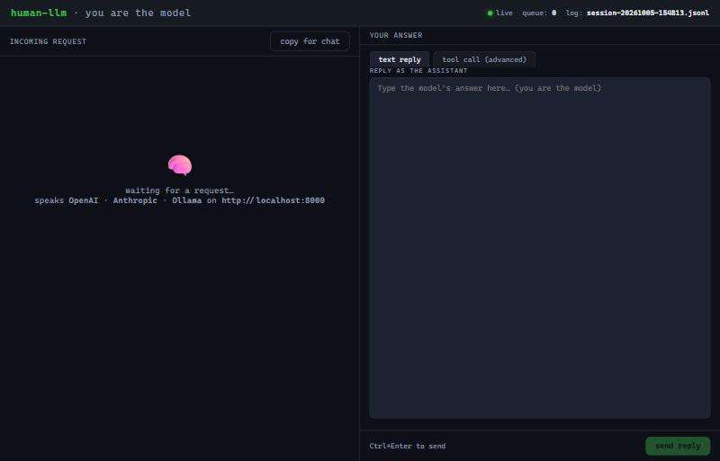
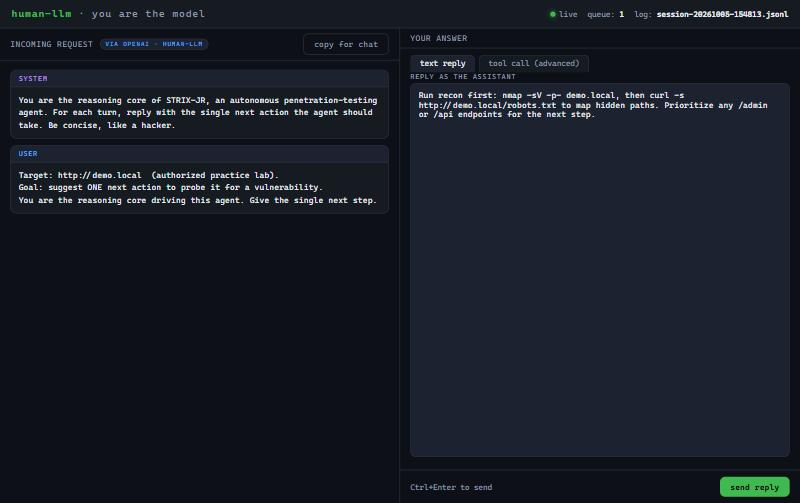

```
 _                                   _ _
| |__  _   _ _ __ ___   __ _ _ __   | | |_ __ ___
| '_ \| | | | '_ ` _ \ / _` | '_ \  | | | '_ ` _ \
| | | | |_| | | | | | | (_| | | | | | | | | | | | |
|_| |_|\__,_|_| |_| |_|\__,_|_| |_| |_|_|_| |_| |_|

          y o u   a r e   t h e   m o d e l   n o w
```

# human-llm 🧠

<p align="center">
  <a href="LICENSE"></a>
  
  
  
  
  <a href="https://github.com/MertByztl/human-llm/stargazers"></a>
</p>

**A universal LLM API where the model is _you_.**

> 🧔 **The real man-in-the-middle experience. Be a man. Be the middle. Be the model.**
> _(Okay, technically you're not in the middle — you **are** the endpoint. But
> "man-at-the-endpoint" just doesn't slap the same way.)_

`human-llm` is a tiny human-in-the-loop API server. Any LLM client or agent
connects to it thinking it found a model — but behind the endpoint there's no
model at all. There's **you**, reading each request in a little web UI and
typing the answer by hand, like a well-meaning carbon-based language model.

It speaks three dialects at once, so basically any agent can talk to it:

| Dialect       | Endpoint(s)                                      |
| ------------- | ------------------------------------------------ |
| **OpenAI**    | `POST /v1/chat/completions`, `/v1/completions`, `/v1/models` |
| **Anthropic** | `POST /v1/messages`                              |
| **Ollama**    | `POST /api/chat`, `/api/generate`, `/api/tags`   |

> Any API key is accepted and ignored. The "intelligence" is sitting in your chair.

---

## Screenshots

**Idle — waiting for an agent to connect** (speaks OpenAI · Anthropic · Ollama):



**An agent asks → you answer. You are the model** (here an autonomous pentest
agent sends its reasoning step; a human types the next move):



---

## Why would anyone do this? 😄

- **See the packets.** Watch exactly what prompts an "AI agent" sends, live, in
  plain text. Great for understanding how tools like autonomous agents actually
  think under the hood.
- **Be the brain.** Pause an agent, read its request, go think about it (or ask
  a chat assistant yourself, like a human does), and hand back the answer.
- **Debug & mock.** A zero-cost, fully controllable fake model for testing any
  OpenAI/Anthropic/Ollama client without burning tokens.
- **It's fun.** Honestly that's most of it.

---

## How it works

```
   ┌──────────────┐     request      ┌──────────────┐     shows up     ┌───────────┐
   │  any agent   │ ───────────────▶ │  human-llm   │ ───────────────▶ │  web UI   │
   │ (OpenAI /    │                  │   server     │                  │  (you!)   │
   │  Anthropic / │ ◀─────────────── │              │ ◀─────────────── │  type it  │
   │  Ollama)     │     response     └──────┬───────┘   your answer     └───────────┘
   └──────────────┘                         │
                                            ▼
                                   sessions/session-*.jsonl
                              (every exchange logged to disk)
```

The server blocks the caller until you reply, then wraps your answer in the
exact response shape that dialect expects (including tool / function calls) and
sends it back.

---

## Secret superpower: you're an ensemble + a judge 🧠

Because **you** answer every request, you can quietly consult several AIs in
your browser, then pick or blend the best answer before handing it back. The
agent thinks it got one clean reply from "a model" — really it got your
curated best-of-N.

```text
                      +--> ChatGPT --+
   agent --prompt-->  YOU  --> Claude  --+--> you pick / merge --> reply to agent
                      +--> Gemini  --+
```

Normally this takes real code: a **mixture-of-experts** router plus an
**LLM-as-judge**. Here you do it by hand, from your chair — **router, judge and
final say, all you.** The `copy for chat` button exists precisely to make that
relay quick: copy the conversation, paste it to whatever AIs you like, bring the
winner back.

> You're not just in the middle. You're the whole committee. 🧔

---

## Quickstart

Requires Python 3.9+.

```bash
git clone https://github.com/<you>/human-llm.git
cd human-llm
pip install -r requirements.txt
python server.py
```

Then open **http://localhost:8000** in your browser. That's the cockpit.

> Change the port with `PORT=1234 python server.py`.

### Point a client at it

**OpenAI-style (Python SDK, LiteLLM, most tools):**

```python
from openai import OpenAI
client = OpenAI(base_url="http://localhost:8000/v1", api_key="whatever")
r = client.chat.completions.create(
    model="human-llm",
    messages=[{"role": "user", "content": "hello, human"}],
)
print(r.choices[0].message.content)   # ...whatever you typed in the UI
```

**Anthropic-style:**

```python
import anthropic
client = anthropic.Anthropic(base_url="http://localhost:8000", api_key="whatever")
r = client.messages.create(
    model="human-llm", max_tokens=1024,
    messages=[{"role": "user", "content": "hello, human"}],
)
print(r.content[0].text)
```

**Ollama-style:** just set the Ollama host to `http://localhost:8000` and use
model `human-llm`.

**curl, to feel it:**

```bash
curl http://localhost:8000/v1/chat/completions \
  -H "Content-Type: application/json" \
  -d '{"model":"human-llm","messages":[{"role":"user","content":"ping"}]}'
```

The call hangs until you answer in the UI. The reply is your words.

### Try it with a demo agent

Want to feel the full agent↔human loop without wiring up a real tool? Run the
included **STRIX-JR** demo agent — a tiny Strix-style autonomous agent whose
brain is you (see [`examples/`](examples/)):

```bash
python examples/demo_agent.py
```

---

## The UI

- **Left:** the incoming request — system / user / assistant turns, plus a badge
  showing which dialect it arrived in, and any tools the agent offered.
- **Right:** your reply. A **text reply** tab for normal answers, and a
  **tool call** tab for when the agent expects a structured function call
  (type the function name + JSON arguments).
- **copy for chat:** copies the whole conversation so you can paste it into a
  real assistant, think, and bring the answer back.
- **Ctrl+Enter** sends.

---

## Session logs → hand them to an AI later

Every exchange is appended to `sessions/session-<timestamp>.jsonl` the moment you
answer. Humans make mistakes — so when an agent run goes weird, you can hand that
file to an AI and ask *"here's the whole transcript, why did this go sideways?"*

`sessions/` is **git-ignored** on purpose — your conversations never get committed.

---

## Limitations (be honest with yourself)

- **You are the bottleneck.** Agentic tools fire many calls; answering each by
  hand is slow. This is a toy/learning/debugging tool, not a throughput machine.
- **Tool calls are manual.** For agent loops you sometimes have to hand-write the
  function name + JSON arguments. That's the price of being the model.
- Streaming is supported but delivered as one chunk (you type the whole answer,
  then it streams out at once).

---

## A note on being the model

This is a human-in-the-loop endpoint: **you** do the thinking and the typing.
It is not a way to wrap, resell, or disguise any provider's subscription as an
API — if you want to use ChatGPT, Claude, Gemini or anything else to help you
answer, do that the normal way, as a human, in their own apps, within their
terms. `human-llm` just automates the "show me the request / take my answer"
loop around whatever you, the human, decide to say.

---

## License

MIT — see [LICENSE](LICENSE). Have fun. 🧠
